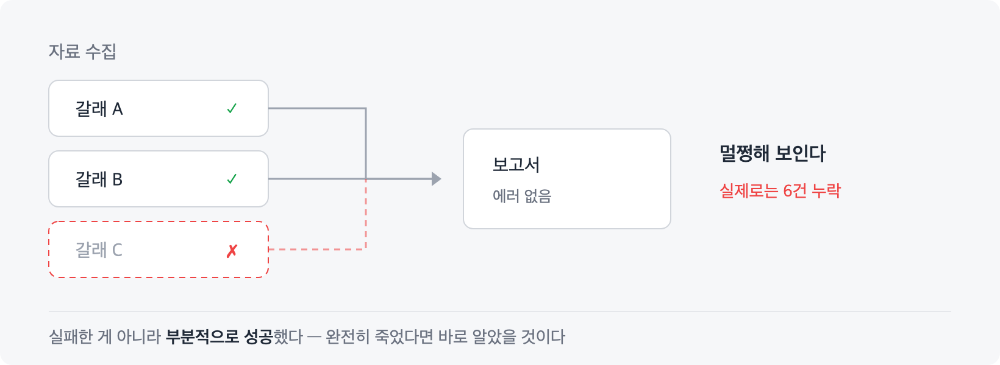
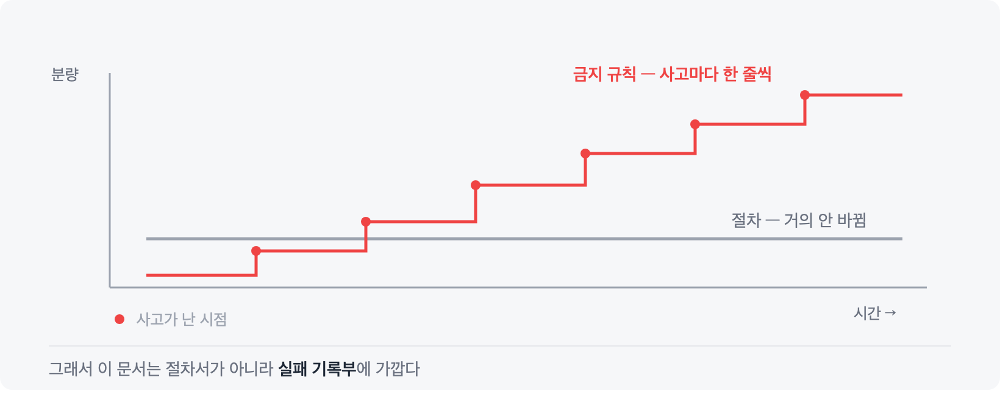
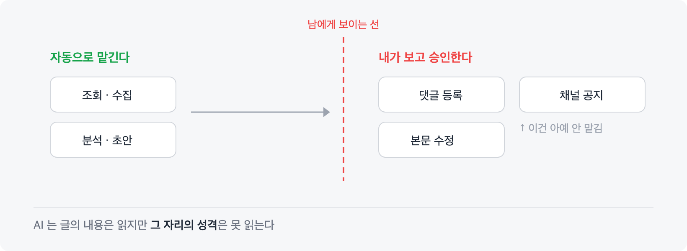

# 자동화 문서를 계속 고치다 보니, 절차서가 아니라 사고 기록부가 되어 있었다

AI 코딩 에이전트에게 반복 업무를 맡기기 시작한 지 몇 달이 지났다. 매번 같은 설명을 반복하는 게 싫어서, 자주 하는 작업들을 문서로 고정해두고 트리거 문구로 불러 쓰는 방식이다. 지금은 네 개가 돌아간다. 작업 기록 남기기, 이슈 트래커 기반 코드 작업, 패키지 배포와 검증, 주간 업무보고 초안 만들기.

오늘 그 네 개 문서를 오랜만에 통째로 다시 읽어봤다. 그리고 좀 이상하다는 걸 알았다.

**절차 설명보다 "하지 마라"가 더 많았다.**

---

## 시작은 단순했다

동기는 두 가지였다.

하나는 그냥 내가 편하려고. 매번 같은 맥락을 다시 설명하는 게 아까웠다.

다른 하나는 조금 다르다. **내가 하는 만큼은 해줬으면 했다.** 작업 기록을 남기더라도 내가 쓰던 형식으로, 배포를 하더라도 내가 챙기던 순서대로. 편의보다는 품질 기준을 옮겨 담고 싶었던 쪽에 가깝다.

그래서 처음엔 이렇게 생각했다.

> 절차를 빠짐없이 적어두면 되겠지.

절반만 맞았다.

생각보다 잘했다. 그리고 생각보다 못하는 경우도 많았다. 이 두 문장이 동시에 참인 게 처음엔 이해가 안 됐는데, 지금은 당연하다고 본다.

절차를 안 지켜서 실패한 게 아니라, **절차에 안 적힌 걸 몰라서** 실패했기 때문이다.

---

## 절차대로 했는데 사고가 났다

두 건만 적는다. 둘 다 실제로 있었던 일이고, 지금 문서에 경고문으로 박혀 있다.

**하나. 재시작을 하나 빠뜨렸다.**

> 서비스 배포 후 데몬을 재시작하는 절차가 있었다. 그런데 미터링 데몬이 별도 프로세스가 아니라 다른 에이전트가 기동할 때 띄우는 자식 프로세스였다. 메인 데몬만 재시작하니 미터링이 조용히 멈췄다.
>
> 에러도 안 났고 알림도 안 왔다. **20일 뒤에야 발견했다.**

**둘. 수집 대상 하나를 건너뛰었다.**

> 주간보고를 만들 때 세 갈래로 자료를 모으는데, 그중 하나가 실행에서 누락됐다. 나머지 두 갈래는 정상이었으니 보고서는 멀쩡해 보였다.
>
> 실제로는 작업 6건이 통째로 빠졌고 한 컴포넌트는 아예 비어 있었다.

두 사고의 공통점이 보인다.

**실패한 게 아니라 부분적으로 성공했다.**

그게 더 나쁘다. 완전히 죽으면 바로 아는데, 절반만 돌면 모르고 넘어간다.

---

## 문서의 성격이 바뀌었다

이런 일이 생길 때마다 문서에 한 줄씩 덧붙였다. 그걸 몇 달 반복하고 나니 문서의 성격 자체가 바뀌어 있었다.

지금 그 문서들에서 규칙만 뽑아보면 이런 것들이다.

- 이 대상을 조용히 건너뛰지 말 것
- 수집이 안 됐으면 결과물 맨 위에 "누락 가능"이라고 **명기**할 것
- 이 티켓 종류는 고객 문의가 아니다 (잘못 분류한 적 있음)
- 이 필드로는 상태 변경이 안 된다
- 결과물을 자동으로 열지 말 것

전부 금지문이고, 전부 뒤에 사건이 하나씩 있다. 그래서 나는 규칙 옆에 **날짜와 사건을 같이 적어둔다.** "2026-07-31 실행에서 누락돼 6건이 빠졌다" 같은 식으로.

처음엔 그냥 기억용이었는데, 쓰다 보니 다른 쓸모가 생겼다. **이 규칙을 나중에 지워도 되는지 판단할 수 있다.** 근거 없는 규칙은 쌓이기만 하고 아무도 못 지운다. 근거가 붙어 있으면 "이 사건은 이제 구조적으로 안 생긴다"고 판단해서 정리할 수 있다.

그래서 나는 이 문서들을 이제 절차서라고 생각하지 않는다.

**실패 기록부에 가깝다.**

절차는 처음 한 번 적으면 거의 안 바뀌는데, 금지 규칙은 계속 늘어난다. 가치도 그쪽에 있다.

---

## 침묵을 막는 데 가장 많은 규칙을 썼다

다시 읽으면서 알게 된 또 하나는, 규칙들이 한 방향으로 쏠려 있다는 거였다. **"조용히"라는 말이 계속 나온다.**

> 조용히 건너뛰지 말 것.
> 무언의 생략 금지.
> 조용히 멈춘다.
> 못 모았으면 못 모았다고 쓸 것.

자동화에서 제일 무서운 건 에러가 아니다. 에러는 보이니까 고친다. 무서운 건 **그럴듯한 결과물이 나오는데 안이 비어 있는 것**이다. 사람이 하면 "어? 이번 주에 이것밖에 안 했나?" 하고 이상함을 느끼는데, 자동화는 그냥 낸다.

그래서 지금은 이런 걸 강제한다.

- 자료를 못 모았으면 결과물 최상단에 경고 문구를 넣는다
- 판단이 애매해서 뺀 항목은 완료 메시지에 목록으로 남긴다 (넣을지는 내가 정한다)
- 불확실한 추정값은 그 추정 자체를 사람에게 보여주고 승인받는다

마지막 건 좀 재밌는데, 세션 시작 시각을 추정하는 방법이 원리상 부정확할 수 있다는 걸 알고 있다. 병렬로 다른 세션이 돌면 엉뚱한 값을 읽을 수 있다. 근데 이걸 완전히 고칠 방법이 없었다. 그래서 **고치는 대신 문서에 적어뒀다.**

> 이 방법은 틀릴 수 있으니 산출된 값을 반드시 사람에게 보여주고 승인받아라.

한계를 없애지 못하면 최소한 숨기지는 말자는 쪽으로 정리했다.

---

## 그런데 규칙으로 안 되는 게 있었다

여기까지는 규칙을 더 정교하게 쓰면 해결되는 문제들이다. 그런데 그렇게 해결이 안 되는 게 있었다.

**팀 채널 공지를 자동화했다가 뺐다.**

기술적으로는 잘 됐다. 배포하면 채널에 알림이 올라갔다. 그런데 쓰다 보니 걸리는 게 있었다. 채널에는 사람들의 **대화 흐름**이 있는데, 자동 메시지가 그걸 끊었다. 정보로는 맞는 말인데, 그 자리에서 그 타이밍에 끼어들 말이었냐면 아니었다.

지금은 채널 공지를 아예 안 한다. 초안조차 만들지 않는다. 내가 직접 쓴다.

**이슈 트래커 댓글도 결국 승인을 받게 했다.**

두 가지가 반복됐다.

하나는 내 의도와 다르게 쓰이는 것. 이건 그래도 예상 범위였다.

문제는 다른 하나였다. **내용상으로는 분명히 관련 있는 자리인데, 실제로는 거기서 그 말을 하면 안 되는 자리**에 댓글을 다는 경우가 꽤 있었다. 다른 팀 소관이라 내가 의견을 낼 자리가 아니거나, 관련은 있지만 그 스레드에서 꺼낼 얘기가 아니거나.

이건 규칙을 더 잘 써서 막을 수 있는 종류가 아니었다. 판단이 필요한 문제니까.

그래서 지금은 자동 모드로 돌리더라도 **댓글과 본문 수정만은 무조건 초안을 보여주고 승인을 받게** 해뒀다. 나머지는 알아서 하되 이건 예외다.

---

## AI는 문서를 읽지만 자리를 못 읽는다

두 사례를 나란히 놓고 보니 뿌리가 같았다.

AI는 **글의 내용**은 잘 읽는다. 이 이슈가 저 이슈와 관련 있다는 건 나보다 빨리 찾는다. 그런데 **그 자리의 성격**은 못 읽는다. 여기가 누구의 공간인지, 지금 이 대화가 어떤 흐름인지, 이 말을 여기서 하면 누가 불편해지는지.

그건 문서에 안 적혀 있다. 적을 수도 없다. 팀에서 몇 년 일하면서 쌓인 감각이라서, 규칙으로 옮기려는 순간 다 흘러내린다.

그래서 지금 내 경계는 이렇게 정리됐다.

**읽는 것은 자동으로, 쓰는 것은 승인 후에.**

조회·수집·분석·초안 작성은 전부 맡긴다. 잘한다. 그런데 그 결과가 **다른 사람에게 보이는 순간**부터는 내가 본다. 채널이든 댓글이든 마찬가지다.

---

## 아직 안 되는 것

정직하게 덧붙이면, 지금도 잘 안 되는 게 있다. 세션 상태를 실시간으로 보여주는 패널을 만들어 쓰고 있는데 아직 동작이 불안정하다. 계속 손봐야 할 것 같다.

그리고 하나 더. 지금까지 만든 것 중에 **버린 건 없다.** 처음엔 이게 좋은 신호인 줄 알았는데, 다시 생각해보니 당연한 결과다. 미리 설계해서 만든 게 하나도 없기 때문이다. 전부 같은 일을 세 번쯤 반복하다가 짜증이 나서 만들었다. 필요해서 만든 것만 있으니 버릴 게 없다.

크게 고친 적은 있다. 처음엔 공식 API로 자료를 모았는데 한계가 있어서, 나중에 내부 웹 API를 쓰는 경로로 갈아탔다. 이런 교체는 앞으로도 계속 생길 것 같다.

---

## 남은 생각

자동화 이야기는 보통 "이만큼 자동화했다"로 끝난다. 그런데 몇 달 굴려보니 정작 중요했던 건 **어디까지 자동화하지 않을지**를 정하는 쪽이었다.

절차를 옮기는 건 쉽다. 어려운 건 두 가지다. 하나는 실패가 조용히 지나가지 않게 만드는 것. 다른 하나는 판단이 필요한 자리를 알아보고 거기서 멈추는 것.

전자는 규칙으로 된다. 사고가 날 때마다 한 줄씩 적으면 문서가 알아서 두꺼워진다.

후자는 규칙으로 안 된다. 그건 그냥 내가 해야 하는 몫인 것 같다.
