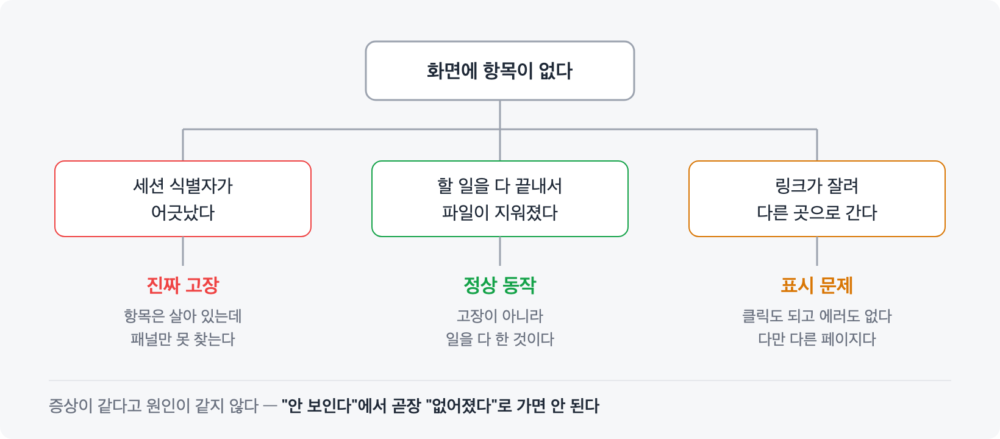

# 상태를 보여주는 패널을 만들었더니, 무엇을 안 보여줄지가 일이 됐다

AI 에이전트와 일을 나눠 하다 보니 세션을 여러 개 띄우게 됐다. 그러자 새 문제가 생겼다. **지금 어디까지 와 있는지가 안 보인다.**

대화가 길어지면 앞에서 정한 것들이 위로 밀려 올라간다. 아까 받은 링크, 지금 손대고 있는 파일, 다음에 할 일. 다 대화창 어딘가에 있긴 한데 스크롤을 한참 올려야 나온다. 여러 세션을 오가면 그게 세션 수만큼 늘어난다.

그래서 화면 아래에 작은 패널을 하나 붙였다. 지금 세션의 할 일, 참조 중인 링크, 다뤘던 파일을 실시간으로 보여주는 것이다. 대충 이렇게 생겼다.

```
TODO  남은 2 · 진행 1 · a3f21c8e · 17:33:09
── 이슈 ──────────────────────────────────────────
▸ #1114 로거가 트래픽 방향을 반대로 기록함   https://tracker.example.com/tasks/1114
▸ #1120 캐시가 안 갱신돼 값이 어긋남         https://tracker.example.com/tasks/1120
▸ 초안 #1114 회신 댓글   /tmp/scratch/draft-1114-comment.md
── 세션 ──────────────────────────────────────────
● 방향 판정 로직 수정
○ 개발 환경에서 재현 확인
✓ 원인 규명
── 파일 ──────────────────────────────────────────
✎ collector/receiver.py
✎ tests/test_receiver.py
```

세 칸이다. 위에는 지금 붙들고 있는 이슈 링크, 가운데는 이번 세션의 할 일, 아래는 손댄 파일. 10초마다 갱신되고 터미널 아래쪽 몇 줄만 차지한다.

쓰다 보니 두 가지가 특히 쓸모 있었다. **링크와 파일은 눌러서 바로 연다** — 대화를 거슬러 올라가 주소를 찾을 필요가 없다. 그리고 **가운데 칸이 방향을 잡아준다.** 다른 세션에 갔다 돌아왔을 때 여기만 보면 어디까지 했고 뭐가 남았는지 바로 붙는다.

만들 때 생각한 문제는 "무엇을 보여줄까"였다. 실제로 시간을 쓴 건 전부 **무엇을 안 보여줄까**였다.

---

## "사라졌다"의 원인이 셋이었다

패널을 쓰다 보면 종종 항목이 없어진다. 분명 등록해뒀는데 화면이 비어 있다.

처음엔 패널 버그라고 생각했다. 몇 번 겪고 나서 원인을 하나씩 찾았는데, **서로 다른 원인이 셋이었다.**

**하나. 세션 식별자가 어긋난 경우.** 대화가 백그라운드 작업으로 전환되면 세션 ID가 바뀐다. 패널은 예전 ID를 계속 보고 있으니 아무것도 못 찾는다. 등록된 항목은 멀쩡히 살아 있는데 패널만 못 보는 상태다. **이건 진짜 고장이다.**

**둘. 다 끝낸 경우.** 할 일을 전부 완료하면 그 파일들이 지워진다. 패널에는 "등록된 항목 없음"이 뜬다. **이건 정상 동작이다.** 고장이 아니라 일을 다 한 것이다.

**셋. 링크가 잘린 경우.** 이건 좀 다른데, 아래에서 따로 적는다.



**증상이 셋 다 똑같다.** 화면에 있어야 할 게 없다. 그런데 하나는 고장이고 하나는 정상이고 하나는 표시 문제다.

그래서 지금은 진단 순서를 정해뒀다. 먼저 항목 파일이 실제로 있는지 본다. 없는데 완료 카운터가 0보다 크면 그냥 다 한 것이다. 파일이 있는데 안 보이면 그때 식별자를 의심한다.

**"안 보인다"에서 곧장 "없어졌다"로 가면 안 된다**는 걸 세 번 만에 배웠다.

---

## 자르면 안 되는 걸 잘랐다

패널은 좁다. 화면 아래 몇 줄이 전부라 긴 문자열이 다 안 들어간다. 그래서 폭이 모자라면 뒤를 잘라 `…`을 붙이게 해뒀다.

이슈 링크를 핀으로 꽂아두고 클릭해서 이동하는 식으로 쓰는데, 어느 날부터 클릭하면 엉뚱한 목록 페이지로 갔다.

원인은 줄이는 코드였다. 폭이 아주 부족하면 **제목뿐 아니라 URL까지 잘랐다.** 링크 끝자리가 날아가니 식별자가 깨지고, 서버는 깨진 식별자를 받으면 에러 대신 **기본 목록으로 넘겨버린다.**

그래서 이렇게 보인다.

- 클릭은 된다
- 페이지도 열린다
- 에러도 없다
- 다만 다른 페이지다

⚠️ 게다가 **패널 폭이 일정 크기 아래일 때만** 재현됐다. 창을 좌우로 나눠 쓸 때만 나타나니, 평소 쓰던 배치에서는 멀쩡했다.

고치고 나서 규칙 하나를 세웠다. **줄일 때는 버려도 되는 것만 버린다.** 제목은 잘려도 사람이 읽을 수 있지만 링크는 한 글자만 없어도 다른 곳을 가리킨다. 이제 자리가 정 없으면 제목을 통째로 버리고 링크만 남긴다.

---

## 다 보여줬더니 아무것도 안 보였다

가장 최근에 겪은 건 파일 목록이다. 세션에서 다룬 파일을 패널에 띄우고 클릭으로 열 수 있게 하고 싶었다.

**세 번 왕복했다.**

**1차** — 파일을 쓰거나 고친 기록만 모았다. 그랬더니 명령어로 복사해 만든 파일이 빠졌다. 정작 그날의 결과물이었는데.

**2차** — 그래서 "대화에 나온 경로를 전부"로 넓혔다. 이번엔 반대가 됐다. 임시 파일, 설정 파일, 도구 스크립트, 중간에 참고한 문서까지 쏟아졌다. 여덟 줄 남짓한 자리에 정작 봐야 할 게 밀려났다.

**3차** — 기준을 다시 잡았다. **"나를 위해 만들어진 것만."** 작업하느라 거쳐 간 것과 결과로 남은 것은 다르다.

이 기준이 말로는 명확한데 코드로 옮기기가 어려웠다. 파일 시스템에는 "누구를 위해 만들어졌는가"가 안 적혀 있다.

---

## 파일 생성 시각으로 판별하려다 실패했다

3차에서 처음 떠올린 방법은 생성 시각이었다. 이번 작업 중에 생긴 파일이면 결과물이고, 원래 있던 걸 고친 거면 아니다. 깔끔해 보였다.

**안 됐다.** 필터를 넣었는데 전부 통과했다.

이유는 파일을 안전하게 쓰는 방식에 있었다. 대부분의 도구는 원본을 직접 고치지 않는다. 임시 파일을 새로 만들어 내용을 다 쓴 다음, 그걸 원래 이름으로 바꿔치기한다. 쓰다가 죽어도 반쯤 망가진 파일이 안 남게 하려는 것이다.

그런데 이러면 **파일의 정체가 매번 새것이 된다.** 경로만 그대로일 뿐 내부적으로는 새로 만들어진 파일이고, 생성 시각도 방금이다. **내용만 고쳐도 "방금 만들어짐"이 된다.**

이 실패가 좀 고약했던 건 **아무 에러도 안 났다**는 점이다. 조건이 항상 참이 되니 필터가 있으나 마나였다. 코드에는 필터가 멀쩡히 적혀 있어서 눈으로 봐서는 문제를 못 찾는다.

결국 다른 방법으로 갔다. 명령을 뜯어봐서 **무언가를 만들거나 옮기는 명령에 등장한 경로만** 모으기로 했다. 읽기만 한 파일은 안 잡힌다.

---

## 고쳤다고 생각한 게 안 고쳐져 있었다

그렇게 정리했다고 생각하고 며칠 뒤 화면을 봤더니, 설정 파일과 실행 파일이 여전히 올라와 있었다. 파고들었더니 **틀린 데가 세 군데 더 있었다.**

**하나. 필터를 만들어놓고 연결을 안 했다.**

판별하는 부분을 새로 짰는데, 정작 그걸 호출하는 자리에 넣지 않았다. 조건문 하나가 통째로 빠진 셈이다. 코드에는 필터가 멀쩡히 적혀 있으니 **읽어봐도 문제가 안 보인다.** 에러도 당연히 안 난다.

**둘. 에러 버리는 걸 파일 쓰기로 봤다.**

"화살표 뒤에 경로가 오면 파일에 쓰는 것"이라고 판별했는데, `2>/dev/null`이 그 모양이다. 에러 출력을 버린다는 뜻이지 뭘 만드는 게 아니다. 그런데 이건 거의 모든 명령 끝에 붙는 관용구다. **사실상 모든 명령이 쓰기로 통과했다.**

**셋. 지시문에 적힌 명령 예시를 실행된 명령으로 봤다.**

다른 에이전트에게 일을 넘길 때 "이런 식으로 하면 된다"고 명령 예시를 적어 보낸다. 그건 설명이지 실행이 아니다. 그런데 그 안의 인용 기호가 리다이렉션 문법과 모양이 같아서 걸렸다.

**지시문은 코드가 아니라 글이다.** 여기에 셸 문법 해석을 적용하면 안 된다. 지금은 지시문을 받는 도구는 인자를 아예 안 본다.

세 번 왕복해서 기준을 잡았다고 썼는데, 사실은 여섯 번째였다.

---

## 남의 자리를 뺏지 말 것

마지막으로 짧은 실패담 하나.

패널을 처음엔 화면 위쪽에 붙이려고 했다. 그런데 쓰는 터미널 앱에 위쪽으로 나누는 기능이 없어서, 새 탭을 만들고 이름을 바꾸는 식으로 우회했다.

이름을 바꾸는 명령이 **탭 이름을 바꿨다.** 원래 그 자리에는 세션 이름이 자동으로 표시되고 있었는데 그게 덮여버렸다. 되돌릴 방법도 없었다.

패널 하나 보려다 **세션을 구분하는 정보를 잃은** 셈이다. 결국 위쪽 배치는 통째로 버리고 아래로 통일했다.

---

## 남은 생각

패널은 결국 **몇 줄짜리 화면**이다. 만들면서 시간을 쓴 곳을 돌아보면 이렇다.

- 무엇을 넣을지 정하는 데 — 조금
- 무엇을 뺄지 정하는 데 — 대부분
- 뺀 것 때문에 생긴 문제를 고치는 데 — 나머지

보여주는 도구를 만들었는데 정작 일의 대부분이 **안 보여줄 것을 고르는 일**이었다.

돌아보면 당연한 것 같기도 하다. 다 보여주면 그건 그냥 로그다. 로그는 이미 있었고, 그게 안 읽혀서 패널을 만든 거였다.

---

코드는 [github.com/hcpak/dev-tools](https://github.com/hcpak/dev-tools/tree/main/claude-todo-panel) 에 올려뒀다.
Claude Code 세션 구조에만 의존하니 터미널은 아무거나 써도 된다. 위에 적은 실패들이 어떻게 코드로 남았는지는 거기서 볼 수 있다.
